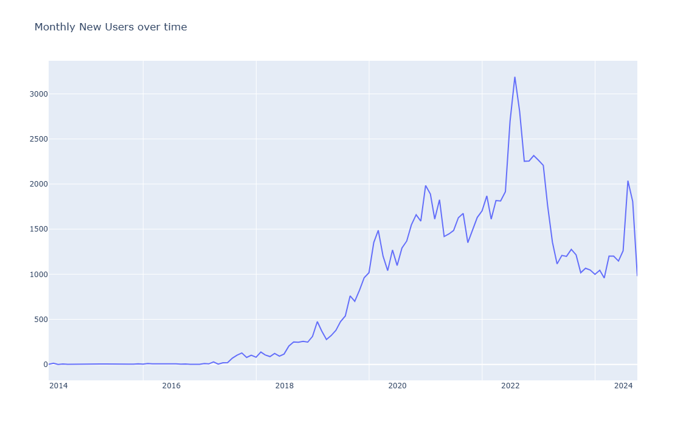
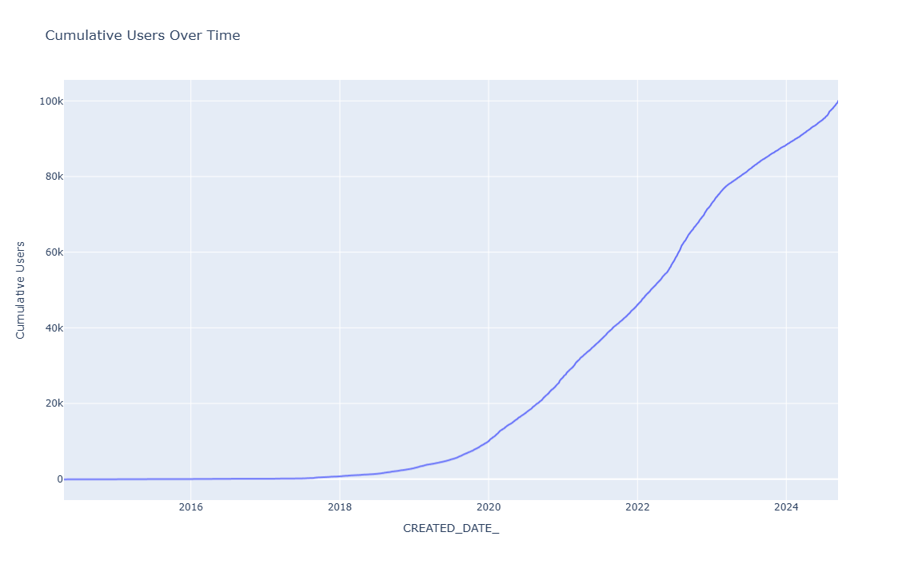

# fetch-project

Project instructions are below, separated into Part 1, Part 2, and Part 3

<b> See answers to in the expandable ANSWER sections</b>

Click the triangle to un-collapse sections.

--------------------------------------------------

<b>Part 1: explore the data</b>
- Review the unstructured csv files and answer the following questions with code that supports your conclusions:
1. Are there any data quality issues present?
2. Are there any fields that are challenging to understand?

<details>
<summary>ANSWER:</Summary>

1. Are there any data quality issues present?
    - Within transactions, there is missing `FINAL_SALE` and `FINAL_QUANTITY` data.
        - These both appear to be business-critical data points, so it is concerning that these are missing. I would like to connect with other data team or software engineering team members to gather historical context and learn if there are any assumptions we can make around the missing data.
    - There are transactions without barcodes.
        - This is not concerning since I imagine that there are niche stores that would be selling products without a traditional barcode.
            - However, if there is an automatic process to create a barcode in the data if one does not exist, then this is cause for concern and something I would want to reach out to developers to understand further.
    - There are products without barcodes.
        - This is not concerning since I assume that product information has been manually entered and not yet incorporated into an automatic system which generates the barcode.
    - There is missing data across the board.
        - My assumption is that only a sample of transactions, users, and products was provided and that there is more data available.
        
2. Are there any fields that are challenging to understand?
    - It is challenging to understand the transactions `FINAL_SALE` field.
        - It is unclear whether this is a sale amount for the full line item, a sale amount which must be multiplied by the quantity, or some total sale amount.
            - I am assuming this is the sale amount for the full line item in my analysis.
    - It is challenging to understand the transactions `FINAL_QUANTITY` field.
        - It is unclear what "zero" means.
            - I am assuming that this is a field which was added later and never backfilled. Any receipts scanned prior to the app version which introduced quantity have been imputed with a text field of "zero". 
            - Since 1 is the most common quantity amount, I will assume that any "zero" values can reasonably be assumed to have a true quantity of 1.
                - After the initial data exploration, I followed this assumption in the SQL files in Part 2.

- More information can be found in [src/part1__data_exploration.py](src/part1__data_exploration.py)
</details>

<br>
<b> Part 2: provide SQL queries</b>

- Answer three of the following questions with at least one question coming from the closed-ended and one from the open-ended question set. Each question should be answered using one query.

<i> 2A Closed-ended questions:</i>

1. What are the top 5 brands by receipts scanned among users 21 and over?
2. What are the top 5 brands by sales among users that have had their 3. account for at least six months?
3. What is the percentage of sales in the Health & Wellness category by generation?

<i> 2B Open-ended questions: for these, make assumptions and clearly state them when answering the question.</i>

1. Who are Fetch’s power users?
2. Which is the leading brand in the Dips & Salsa category?
3. At what percent has Fetch grown year over year?

<details>
<summary>ANSWER:</Summary>

- Questions Chosen:
    - C1. What are the top 5 brands by receipts scanned among users 21 and over?
    - O2. Which is the leading brand in the Dips & Salsa category?
    - O3. At what percent has Fetch grown year over year?
- Assumptions are listed in expandable sections below as well as in [src/part2__run_sql.py](src/part2__run_sql.py) file
    - There are also variations on C1 and O3 based on differing assumptions I might make, specifically if there was more data.
- Queries are reproduced in the expandable sections below.


<details>
<summary>C1. What are the top 5 brands by receipts scanned among users 21 and over?</Summary>

<details>
<summary>C1. Assumptions</Summary>

1. Assumption 1: 
    - I only have a sample of data.
    - The code is set up to run properly if more data is present.

2. Assumption 2: 
    - We want the top 5 results.
    - However, if there is a tie for 5th place, include all brands which are tied for the 5th place spot, as there is is not an inherent order to brands.

3. Assumption 3: 
    - We care about unique receipts scanned, not specific times the brand was on the same receipt.
    - This allows for us to not account for the missing quantity data, which we cannot resolve without understanding business assumptions.
    - Additionally, we believe it is more important for the item to be purchased multiple times in distinct trips to the store, rather than multiples within the same check-out.

4. Assumption 4: 
    - Products without barcodes have been manually entered and are not validated with the system. Therefore, they should not be considered in the analysis.

5. Assumption 5: 
    - Duplicate barcodes in the product data must be resolved.
    - There should only be one set of product details per barcode.
    - The assumption is the product details with the most data is the most accurate, and if there is a tie, then the product details with brand is most accurate.

</details>

```
with users_21_up as (
    --first identify the users 21 and over.
    select *
        , today() as todaysdate
        , todaysdate::TIMESTAMP - interval 21 year as yearsago21
        --, dateadd(year,-21,getdate()) as yearsago21 --AWS Redshift syntax
        , case when BIRTH_DATE::TIMESTAMP is null then 1 else 0 end as missing_birthdate
        , case when BIRTH_DATE::TIMESTAMP<=yearsago21 then 1 else 0 end as atleast21_flag
    from users_df
    where missing_birthdate=0
        and atleast21_flag=1
)
, de_duped_products as (
    --next, de-duplicate barcodes (based on part 1 exploration, this is something which must be fixed)
    --keep the rows with the most data
    --and if that is tied, use the row with brand info
    select *
        , case when CATEGORY_1 is not null then 1 else 0 end
            + case when CATEGORY_2 is not null then 1 else 0 end
            + case when CATEGORY_3 is not null then 1 else 0 end
            + case when CATEGORY_4 is not null then 1 else 0 end
            + case when MANUFACTURER is not null then 1 else 0 end
            + case when BRAND is not null then 1 else 0 end
            as cols_with_info
        , case when BRAND is not null then 1 else 0 end as brand_w_info
        , row_number() over(partition by barcode order by cols_with_info desc, brand_w_info desc) as keep_rn
    from products_df
    where barcode is not null
    qualify keep_rn = 1

)
, top5quantity as (
    --next, identify the quantity of the 5th most receipt
    --This will allow us to resolve ties at 5th place
    select min(unique_receipts) as unique_receipts_at_5th_place
    from (
        --per brand, identify the number of distinct receipts scanned
        --only select the top 5-most receipts
        select p.brand
            , count(distinct t.RECEIPT_ID) as unique_receipts
        from transactions_df t
        join users_21_up u
            on t.user_id=u.id
        left join de_duped_products p 
            on t.barcode=p.barcode
        where t.barcode is not null
        group by p.brand
        having p.brand is not null
        order by count(distinct t.RECEIPT_ID) desc
        limit 5
    )
)
--gather the final result
--identify the number of distinct receipt scans by brand for users 21+
--and pull the top 5 (including anything tied for 5th place)
select p.brand
    --, count(t.RECEIPT_ID) as receipts
    , count(distinct t.RECEIPT_ID) as unique_receipts
from transactions_df t
join users_21_up u
    on t.user_id=u.id
left join de_duped_products p 
    on t.barcode=p.barcode
where t.barcode is not null
group by p.brand
having p.brand is not null
    and unique_receipts>=(select unique_receipts_at_5th_place from top5quantity)
order by count(distinct t.RECEIPT_ID) desc


--I believe these ties should be considered
--However, if this is not necessary, the following should be run as the final result
/*
select p.brand
    --, count(t.RECEIPT_ID) as receipts
    , count(distinct t.RECEIPT_ID) as unique_receipts
from transactions_df t
join users_21_up u
    on t.user_id=u.id
left join de_duped_products p 
    on t.barcode=p.barcode
where t.barcode is not null
group by p.brand
having p.brand is not null
order by count(distinct t.RECEIPT_ID) desc
limit 5
*/
```
</details>

<details>
<summary>O2. Which is the leading brand in the Dips & Salsa category?</Summary>

<details>
<summary>O2. Assumptions</Summary>

1. Assumption 1:
    - The leading brand is the brand with the highest final sales.
    - As there are limited transactions, we can look at all the data, rather than go through an analysis of trending historical data.

2. Assumption 2: 
    - There are no other salsa or dip categories that are not also included in the CATEGORY_2='Dips & Salsa'.
    - This was verified through data exploration for the sample of data I was provided.

3. Assumption 3: 
    - If Final Quantity = 'zero', we assume the quantity = 1.
    - We believe this since we assume the 'zero' data was due to a new feature rollout where data was not backfilled.

4. Assumption 4: 
    - Final Sales is the total amount for the line item (ie it does not need to be multiplied by a quantity).

5. Assumption 5: 
    - Missing Final Sales data can be imputed with the median of the Dips & Salsa product type. The median is gathered from the items in transactions which have Dips & Salsa product details.
    - This accounts for the median based on actual purchases, rather than the median from the product list without considering shopping patterns.
    - Since quantity is almost always 1, and the imputing assumption is not fully trustworthy without more business context, I will not multiply the imputed final sale amount by quantity in order to limit risks of imputing.

6. Assumption 6: 
    - Products without barcodes have been manually entered and are not validated with the system. Therefore, they should not be considered in the analysis.

7. Assumption 7: 
    - Duplicate barcodes in the product data must be resolved.
    - There should only be one set of product details per barcode.
    - The assumption is the product details with the most data is the most accurate, and if there is a tie, then the product details with brand is most accurate.

</details>

```
with de_duped_products as (
    --de-duplicate barcodes (based on part 1 exploration, this is something which must be fixed)
    --keep the rows with the most data
    --and if that is tied, use the row with brand info
    select *
        , case when CATEGORY_1 is not null then 1 else 0 end
            + case when CATEGORY_2 is not null then 1 else 0 end
            + case when CATEGORY_3 is not null then 1 else 0 end
            + case when CATEGORY_4 is not null then 1 else 0 end
            + case when MANUFACTURER is not null then 1 else 0 end
            + case when BRAND is not null then 1 else 0 end
            as cols_with_info
        , case when BRAND is not null then 1 else 0 end as brand_w_info
        , row_number() over(partition by barcode order by cols_with_info desc, brand_w_info desc) as keep_rn
    from products_df
    where barcode is not null
    qualify keep_rn = 1

)
, dips_and_salsa as (
    --only gather the category we care about
    --category2 was identified via earlier exploration
    select *
    from de_duped_products
    where CATEGORY_2='Dips & Salsa'
)
, transaction_details_by_brand as (
    --only for dip and salsa transactions, identify the brand
    --based on assumptions, make final quantity "zero" map to 1
    select t.receipt_id
        , t.purchase_date
        , replace(t.final_sale,' ',NULL)::decimal as final_sale
        , replace(t.final_quantity,'zero','1')::decimal as final_quantity_imputed --impute quantity with 1, not 0, based on stated assumption
        , t.final_sale as final_sale_raw
        , t.final_quantity as final_quantity_raw
        , ds.brand
    from transactions_df t
    join dips_and_salsa ds
        on t.barcode=ds.barcode
        --we can join because if we left join then we will not get any other useful information
        --we need the barcode to set up a proper connection, as nulls will give us no information about if a dip & salsa was purchased
)
, median_salsa_dip_sale as (
    --based on transactions we have, find the median dip and salsa final sale amount
    --this will be used for imputing final sale when nothing else is known
    select median(final_sale) med
    from transaction_details_by_brand
    where final_sale is not null
)
, imputed_details as (
    --based on assumptions, replace blank final sale amount with median sales amount
    select *
        , (case when final_sale_raw=' ' 
            then (select med from median_salsa_dip_sale)::varchar 
            else final_sale_raw 
            end)::decimal 
            as final_sale_imputed
    from transaction_details_by_brand
)
--gather the final result
--identify the top salsa and dip brand, based on total sales
--assuming median salsa and dip sales value when sales value is not present
select brand
    , sum(final_sale_imputed) as total_sales
    , sum(final_quantity_imputed) as total_quantity
from imputed_details
--where brand is not null
group by brand
order by total_sales desc
limit 1
--top result is not a null brand
--if it was, we could add `where brand is not null`, 
--or use these findings to inform the business that missing data is causing a major concern with findings
--I would favor seeing that a null is the most common response rather than filtering it out 
--so that additional data discovery/work with software engineers could be performed
```
</details>

<details>
<summary>O3. At what percent has Fetch grown year over year?</Summary>

<details>
<summary>O3. Assumptions</Summary>

1. Assumption 1:
    - User growth is the measure of Fetch growth.

2. Assumption 2: 
    - The user data provided is a representative sample, even if it is not the full dataset.
    - The data was pulled in the past, so is not current through today, but rather current though the last user created date.

3. Assumption 3: 
    - The standard YOY growth formula is used by Fetch:  (Users This Period-Users Last Period)/Users Last Period
    - This is calculating the full population growth rate, not the new user growth rate.

4. Assumption 4
    - We would like to view YOY growth for the last 5 years.

</details>

```
--identify yoy growth for the last 5 years
with yoy_start as (
    --assumption is that this is a random sample of user data
    --do rolling year from the max date since I believe we have only a sample of data which does not go through present-day
    select max(created_date) as current_date_of_data
    from users_df
)
, user_details as (
    --identify key information about the user
    --including flags indicating when they became part of the user base
    --assumption is that all users provided are still part of our user population 
    select created_date
        , current_date_of_data
        --, dateadd(year,-1,current_date_of_data) as oneyearago --AWS Redshift syntax example
        , current_date_of_data::TIMESTAMP - interval 1 year as oneyearago
        , current_date_of_data::TIMESTAMP - interval 2 year as twoyearsago
        , current_date_of_data::TIMESTAMP - interval 3 year as threeyearsago
        , current_date_of_data::TIMESTAMP - interval 4 year as fouryearsago
        , current_date_of_data::TIMESTAMP - interval 5 year as fiveyearsago
        , case when created_date::timestamp between oneyearago and current_date_of_data then 1 else 0 end as new_0_1_year_ago
        , case when created_date::timestamp between twoyearsago and oneyearago then 1 else 0 end as new_1_2_year_ago
        , case when created_date::timestamp between threeyearsago and twoyearsago then 1 else 0 end as new_2_3_year_ago
        , case when created_date::timestamp between fouryearsago and threeyearsago then 1 else 0 end as new_3_4_year_ago
        , case when created_date::timestamp between fiveyearsago and fouryearsago then 1 else 0 end as new_4_5_year_ago
        , case when created_date::timestamp < fiveyearsago then 1 else 0 end as existing_users_prior_to_5_years_ago
    from users_df
    join yoy_start
        on 1=1
)
, summary_stats as (
    --identify summary stats for the YOY growth
    select sum(new_0_1_year_ago) as total_new_users_0_1_year_ago --unnecessary for calculation, just interesting
        , sum(new_1_2_year_ago) as total_new_1_2_year_ago
        , sum(new_2_3_year_ago) as total_new_2_3_year_ago
        , sum(new_3_4_year_ago) as total_new_3_4_year_ago
        , sum(new_4_5_year_ago) as total_new_4_5_year_ago
        , sum(existing_users_prior_to_5_years_ago) as total_prior_users
        , count(*) as total_users_this_year --all users based on our data
        , total_prior_users
            +total_new_4_5_year_ago
            +total_new_3_4_year_ago
            +total_new_2_3_year_ago
            +total_new_1_2_year_ago 
            as total_users_last_year
        , total_prior_users
            +total_new_4_5_year_ago
            +total_new_3_4_year_ago
            +total_new_2_3_year_ago
            as total_users_two_years_ago
        , total_prior_users
            +total_new_4_5_year_ago
            +total_new_3_4_year_ago
            as total_users_three_years_ago
        , total_prior_users
            +total_new_4_5_year_ago
            as total_users_four_years_ago
        , total_prior_users
            as total_users_five_years_ago
        , (total_users_this_year-total_users_last_year)/total_users_last_year as yoy_growth_last_year_to_this_year
        , (total_users_last_year-total_users_two_years_ago)/total_users_two_years_ago as yoy_growth_two_years_ago_to_last_year
        , (total_users_two_years_ago-total_users_three_years_ago)/total_users_three_years_ago as yoy_growth_three_years_ago_to_two_years_ago
        , (total_users_three_years_ago-total_users_four_years_ago)/total_users_four_years_ago as yoy_growth_four_years_ago_to_three_years_ago
        , (total_users_four_years_ago-total_users_five_years_ago)/total_users_five_years_ago as yoy_growth_five_years_ago_to_four_years_ago
    from user_details
)
--gather final result of yoy growth over the last 5 years
--and present findings as a percent
--max data currently is 9/11/2024
select yoy_growth_last_year_to_this_year*100 as yoy_growth_pct_Sept_2023_2024
    , yoy_growth_two_years_ago_to_last_year*100  as yoy_growth_pct_Sept_2022_2023
    , yoy_growth_three_years_ago_to_two_years_ago*100 as yoy_growth_pct_Sept_2021_2022
    , yoy_growth_four_years_ago_to_three_years_ago*100 as yoy_growth_pct_Sept_2020_2021
    , yoy_growth_five_years_ago_to_four_years_ago*100 as yoy_growth_pct_Sept_2019_2020
from summary_stats

```
</details>

</details>
<br>

<b>Part 3: communicate with stakeholders</b>

- Construct an email or slack message that is understandable to a product or business leader who is not familiar with your day-to-day work. Summarize the results of your investigation. Include:
    - Key data quality issues and outstanding questions about the data
    - One interesting trend in the data
        - Use a finding from part 2 or come up with a new insight
    - Request for action: explain what additional help, info, etc. you need to make sense of the data and resolve any outstanding issues

<details>
<summary>ANSWER:</Summary>

Hello [product or business leader],

I am currently working on building an understanding of our user and transaction growth.</br>
Through my analysis, I have a some interesting initial findings I am excited to share. I also would like your help pointing me in the right direction to address my data quality callouts and outstanding questions.</br>

</br>
With my sample of data, I am observing <b>18% YOY user growth</b> in the last year. </br>
<b>New user growth had declined in mid-2022 through mid-2023 and has been rebounding since.</b> It has yet to fully recover to early-2022 levels.</br>

- My assumption is that our team is focusing on appealing to younger audiences in the next few years (early 20s vs 40s). 
    - This allows us to capture new, young shoppers so that we always have new markets to tap into. This is especially important when we have fully captured the mid-age market in the future.
- The <b>age of the users at signup time has slightly increased in the last year</b>, compared to prior year.
- However, if we would like our target market to be about 40 years old, then we are hitting our desired user-base.
- If we desire to capture a younger market, should we consider creating a campaign to target younger audiences?

Please let me know if you would like additional findings related to user growth.</br>

</br>
</br>
Through my analysis, I uncovered a handful of data quality callouts and have a few outstanding questions.

- Data quality callouts: 
    - There are some products with multiple barcodes. Without a modified date, I am uncertain what is the most updated product information for a barcode.
    - There is both missing price and missing quantity data for numerous transaction records.
    - There are transactions without barcodes. I assume this occurs for niche products, but it is an important data point which is sometimes missing.
    - I appear to be missing access to data:
        - There are transactions which tie to users who do not exist in our user data
        - There are transactions which tie to barcodes that do not exist in our product data
- Outstanding questions:
    - Can you direct me to the teams who can provide access to the full dataset?
        - Based on my findings, I believe I am missing users and missing products in my current dataset. 
        - I also assume I am missing transactions due to the low quantity of data. This does not allow for a full picture of user engagement and would be necessary data to have in order to understand who is a power user and how best to target users.
    - Are there standard assumptions which should be made to fill in the gaps?
        - Specifically, where there is no "final sales" information, and no "final quantity" information (ie "zero"), do we have standard assumptions? These appear to be highly important data points and I do not want to make assumptions that differ from the rest of the team.
        - I believe this data is missing either due to (1) bad receipt scans, or (2) product enhancements which resulted in newly captured data starting a specific point in time. However I cannot yet validate these assumptions.

</br>  
</br>     
<b>Request for Action:</b></br>

1. Can you send me either developer documentation or people who I can connect with to further understand the missing "final sales" and "final quantity" data?</br>
2. Can you please connect me with the teams who can provide me with more data access?</br>

</br>
Thank you so much!</br>
Michelle Bedard
</br>
</br>
</br>
</br>

<i>Appendix</i>

- Plots to support user growth findings
    - New Users over time
        - 
    - Total Users over time
        - 
</details>

--------------------------------------------

Notes:
- Please see package versions in pyproject.toml file for reproducing results.
- Code for the additional analysis conducted for Part 3 can be found in [src/part3__interesting_findings.py](src/part3__interesting_findings.py)
